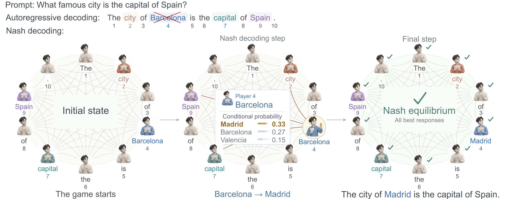
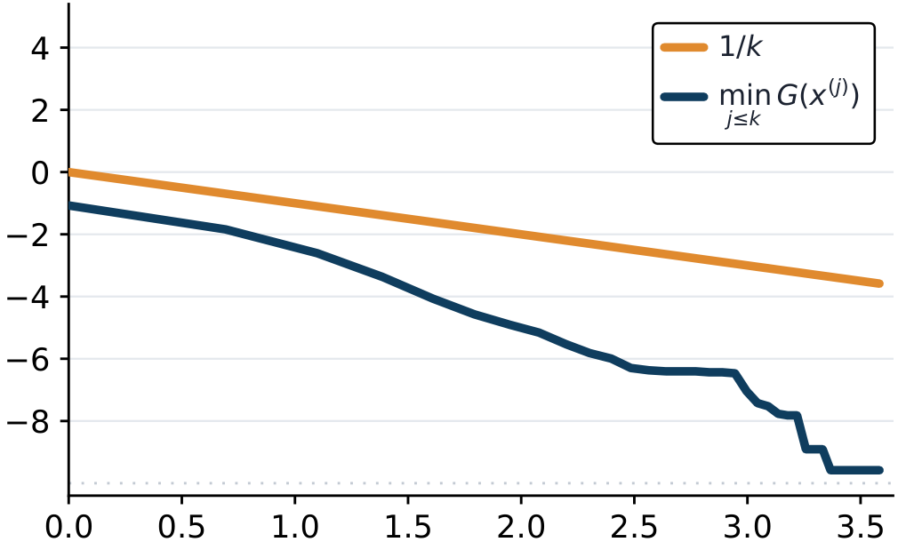
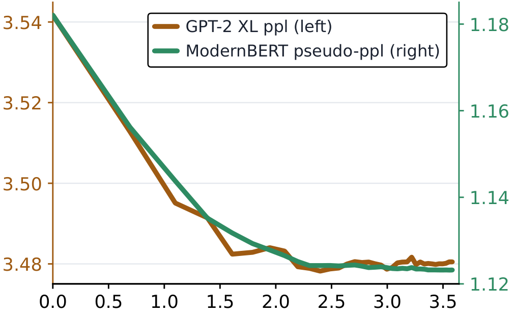
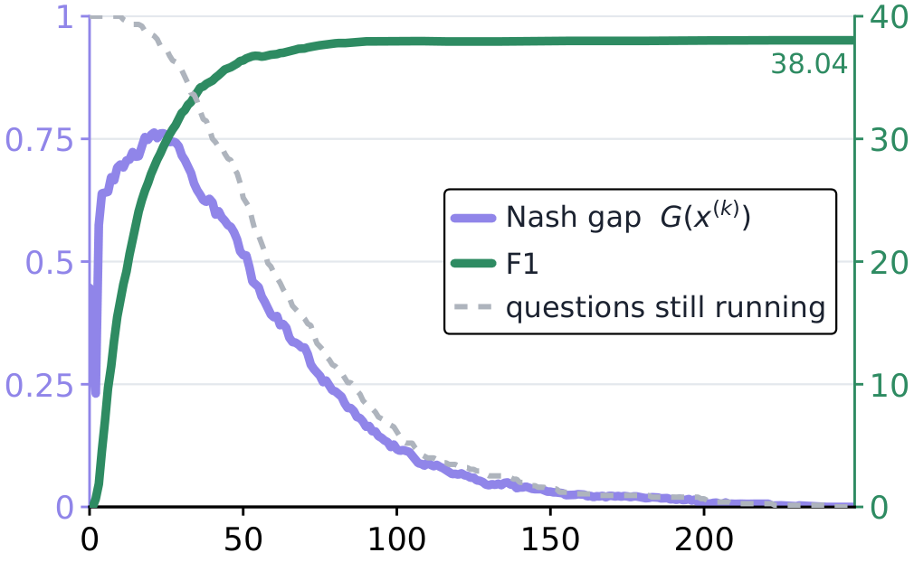
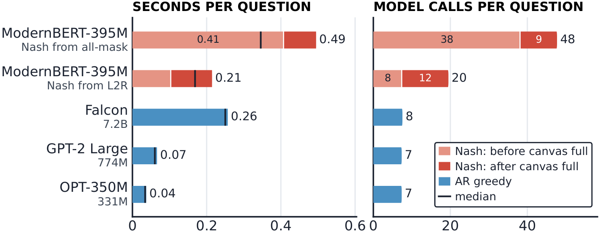

# Nash Equilibrium Text: A Game-Theoretic Decoding Framework for Text Generation

**Alireza Jafari**¹, **Arman Adibi**², **Mohammad Ghavamzadeh**³, **Hadi Daneshmand**¹

¹ Department of Computer Science, University of Virginia · ² School of Computer and Cyber Sciences, Augusta University · ³ Qualcomm AI Research

📄 Paper: arXiv (link to be added) · 💻 Code: [github.com/alireza-jafari/Nash-Decoding](https://github.com/alireza-jafari/Nash-Decoding)

<p align="center">
  
</p>

**Figure 1. Revision Game.** Each token position is a player whose choice is evaluated
given all context tokens. Autoregressive decoding leaves earlier tokens fixed, whereas
the tokens are revised in the revision game. We used GPT-2 small for conditional
probability estimates. At a Nash equilibrium, no player can increase its conditional
probability by changing its token. Details are reported in Appendix A of the paper and
in [`experiments/01_motivating_example`](experiments/01_motivating_example).

## Abstract

Text revision has become an integral component of large language models. This paper
formulates revision such that it admits a Nash equilibrium: Token positions are
players, vocabulary items are actions, and each player's utility is the language
model's log conditional probability. We motivate the revision by showing that Nash
equilibria can have exponentially higher likelihood than autoregressive outputs as the
sequence length grows. We further propose Nash decoding, an algorithm that reaches an
$`\varepsilon`$-Nash equilibrium in $`O(1/\varepsilon)`$ time given access to the joint probability of tokens
conditioned on a prompt. In practice, we run Nash decoding using conditional
probability estimates from large language models and evaluate the resulting equilibria
on question-answering benchmarks. On CLAPNQ, PubMedQA, and CoQA, Nash equilibria
obtained from masked language models achieve higher F1 and ROUGE scores than
autoregressive models up to 18× larger, without any fine-tuning or retraining, at the
cost of additional test-time computation.

---

## The revision game

Revision has become the core in text generation with language models where the first
draft often is the standard de facto autoregressive text obeying

```math
x_{i+1}^{(\mathrm{AR})} = \arg\max_{x \in \mathcal{V}} \; p\big(x \mid x_{\le i}^{(\mathrm{AR})}; \mathrm{prompt}\big), \qquad\qquad (1)
```

where $`p`$ denotes the probability function and $`x_i`$ are tokens selected from a
vocabulary $`\mathcal{V}`$. Autoregressive generation calls for revision because each
token is produced without access to the tokens that follow. We focus on revision driven
solely by conditional probabilities without external feedback. Such revision need not
reach an equilibrium; the text may continue to change indefinitely. We therefore
formulate revision as a game that admits an equilibrium.

> **Revision game:** Given a prompt, $`n`$ players are the positions $`i \in [n]`$, and
> each player's action is a token from $`\mathcal{V}`$ and player $`i`$ receives utility
> $`\log p(x_i \mid x_{-i}; \mathrm{prompt})`$, where $`x_{-i}`$ denotes all tokens
> except $`x_i`$.

Since
$`p(x_i \mid x_{-i}; \mathrm{prompt}) = p(x_1, \dots, x_n \mid \mathrm{prompt}) / p(x_{-i} \mid \mathrm{prompt})`$
and the denominator does not depend on $`x_i`$, this is an exact potential game with
potential $`\log p(x_1, \dots, x_n \mid \mathrm{prompt})`$. Being finite, the game admits
at least one pure Nash equilibrium
$`x^{(\mathrm{nash})} = (x_1^{(\mathrm{nash})}, \ldots, x_n^{(\mathrm{nash})})`$, which
satisfies

```math
\forall i \in [n]: \quad x_i^{(\mathrm{nash})} = \arg\max_{x \in \mathcal{V}} \; p\big(x \mid x_{-i}^{(\mathrm{nash})}; \mathrm{prompt}\big). \qquad\qquad (2)
```

In other words, a sequence is a Nash equilibrium when no single position can increase
its conditional probability by changing its token. Comparing to Equation 1, the above
conditioning is on $`x_{-i}`$ rather than $`x_{<i}`$.

As an example, we simulate this revision game between tokens using GPT-2 prompted by
the question *"What famous city is the capital of Spain?"*. Figure 1 shows revisions of
the first draft generated by autoregressive decoding that is *"The city of Barcelona is
the capital of Spain."* As the game proceeds, the token "Barcelona" is revised to
"Madrid", increasing the likelihood of the full generated text by a factor of
1.26.[^correctness] Nash equilibria can attain substantially higher likelihood than
autoregressive generations: the ratio
$`p(x^{(\mathrm{nash})} \mid \mathrm{prompt}) \,/\, p(x^{(\mathrm{AR})} \mid \mathrm{prompt})`$
can grow exponentially in $`n`$ (Lemma 1;
[`experiments/02_separation_lemma`](experiments/02_separation_lemma)). The motivating
example is reproduced step by step in
[`experiments/01_motivating_example`](experiments/01_motivating_example).

## Nash decoding

We define the **token gap** at position $`i`$ as the largest increase in conditional
probability that a single token replacement at that position can achieve:

```math
g_i(x) = \max_{v \in \mathcal{V}} \; p(v \mid x_{-i}; \mathrm{prompt}) - p(x_i \mid x_{-i}; \mathrm{prompt}). \qquad\qquad (3)
```

The **Nash gap** is the largest improvement available at any position:
$`G(x) = \max_{i \in [n]} g_i(x)`$. The equilibrium condition for
$`x^{(\mathrm{nash})}`$ in Equation 2 is therefore equivalent to
$`G(x^{(\mathrm{nash})}) = 0`$: no position can improve its utility through a unilateral
token replacement. More generally, for a tolerance $`\varepsilon \geq 0`$, $`x`$ is an
additive $`\varepsilon`$-Nash equilibrium if $`G(x) \leq \varepsilon`$: no single-token
replacement improves its position's conditional probability by more than
$`\varepsilon`$.

Recall the formulation of conditional density as

```math
p(x_i \mid x_{-i}; \mathrm{prompt}) = \frac{p(x \mid \mathrm{prompt})}{p(x_{-i} \mid \mathrm{prompt})}. \qquad\qquad (4)
```

The denominator is positive and unchanged by a unilateral deviation. Thus, whenever a
player increases its utility, the joint probability also increases. In game-theoretic
terms, the joint probability is an *ordinal potential*. This property yields a bound on
the number of improving token refinements.

We define Nash decoding as the maximum-gap best-response procedure in Algorithm 1.
Given a tolerance $`0 < \varepsilon \leq 1`$, start from any completed sequence
$`x^{(0)} \in \mathcal{V}^n`$. At iteration $`k \geq 0`$, compute $`g_i(x^{(k)})`$ for
every position $`i \in [n]`$. If $`G(x^{(k)}) \leq \varepsilon`$, return $`x^{(k)}`$.
Otherwise, select a position with the largest gap and replace its token with the best
response, leaving all other tokens unchanged. It terminates when the maximum Nash gap is
at most $`\varepsilon`$, yielding an $`\varepsilon`$-Nash equilibrium.

> **Algorithm 1** &nbsp; Nash Decoding
>
> **Require:** Prompt, initial sequence $`x^{(0)} \in \mathcal{V}^n`$, tolerance $`0 < \varepsilon \leq 1`$ <br>
> **Ensure:** Sequence $`x`$ satisfying $`G(x) \leq \varepsilon`$
>
> 1. $`k \leftarrow 0`$
> 2. **while** $`G(x^{(k)}) > \varepsilon`$ **do**
> 3. &emsp;&emsp; Compute $`g_i(x^{(k)})`$ for all $`i \in [n]`$
> 4. &emsp;&emsp; $`G(x^{(k)}) \leftarrow \max_{i \in [n]} g_i(x^{(k)})`$
> 5. &emsp;&emsp; Select $`i_k \in \arg\max_{i \in [n]} g_i(x^{(k)})`$
> 6. &emsp;&emsp; Set $`x_{i_k}^{(k+1)} \in \arg\max_{v \in \mathcal{V}} p\big(x_{i_k} = v \mid x_{-i_k}^{(k)}; \mathrm{prompt}\big)`$
> 7. &emsp;&emsp; Set $`x_i^{(k+1)} \leftarrow x_i^{(k)}`$ for all $`i \neq i_k`$
> 8. &emsp;&emsp; $`k \leftarrow k + 1`$
> 9. &emsp;&emsp; **Break if** $`x^{(k)}`$ is visited before
> 10. **end while**
> 11. **return** $`x^{(k)}`$

**Theorem 1 (Convergence Rate).** Let $`0 < \varepsilon \leq 1`$ and let
$`p_0 = p(x^{(0)} \mid \mathrm{prompt}) > 0`$ be the initial sequence probability. Every
performed update of the above dynamics satisfies

```math
\frac{p(x^{(k+1)} \mid \mathrm{prompt})}{p(x^{(k)} \mid \mathrm{prompt})} \geq 1 + \underbrace{G(x^{(k)})}_{>0}. \qquad\qquad (5)
```

The dynamics terminate at an additive $`\varepsilon`$-Nash equilibrium after
$`K_\varepsilon`$ token replacements, with

```math
K_\varepsilon \leq \frac{\log(1/p_0)}{\log(1+\varepsilon)} \leq \frac{2\log(1/p_0)}{\varepsilon}. \qquad\qquad (6)
```

The bound depends logarithmically on the inverse initial probability: a more probable
starting sequence yields a tighter guarantee. Recomputing all gaps after each
replacement requires $`O\big(n \log(1/p_0)\, \varepsilon^{-1}\big)`$ density evaluations,
including the final scan that certifies termination. A consequence of this result is:
for every $`x^{(\mathrm{AR})}`$ in Equation 1, there exists a Nash equilibrium whose
likelihood is higher as long as it is not an equilibrium.

The rule is implemented once, in [`nashlib/nash.py`](nashlib/nash.py), and shared by
every experiment; the bookkeeping a reported run needs -- the two constructions, cycle
and cap detection, and the per-update trajectory the figures are drawn from -- lives
beside it.

### Nash decoding with pretrained language models

Nash decoding relies on the conditional probability
$`p(v \mid x_{-i}; \mathrm{prompt})`$ of token $`v`$ at position $`i`$ given the rest of
the sequence. A masked language model (MLM), such as BERT, provides the conditional
estimates needed for Nash decoding. For each position $`i`$, we replace $`x_i`$ with
[MASK] while retaining the prompt and all other tokens, and apply softmax to the logits
at the masked position. Because the model is pretrained to reconstruct masked tokens
from their surrounding context, we use this distribution as an estimate of
$`p(v \mid x_{-i}; \mathrm{prompt})`$. Nash decoding can also use an autoregressive
model, as illustrated by the motivating example, but computing the full-context
conditional is expensive because each replacement can change subsequent token
probabilities.

The conditional distributions supplied by a masked language model need not be
compatible with a common joint distribution. Consequently, the convergence guarantee
in Theorem 1 does not necessarily hold for the conditional probability estimates; hence,
we empirically validate the convergence to Nash equilibrium.

### Empirical validation of Theorem 1

We experimentally validate (1) the convergence rate and (2) likelihood monotonicity in
Theorem 1. Using ModernBERT, we generate 64-token continuations for 500 prompts from
WikiText-103. Each continuation starts from 64 [MASK] tokens and repeatedly replaces
the maximum-gap token with its best response (details in Appendix C of the paper;
[`experiments/03_wikitext_dynamics`](experiments/03_wikitext_dynamics) spells out the
two stages this is run in).

<table>
  <tr>
    <td align="center" width="50%">
      
      <br>(a) Convergence Test
    </td>
    <td align="center" width="50%">
      
      <br>(b) Monotonicity Test
    </td>
  </tr>
</table>

**Figure 2.** Convergence of Nash decoding on WikiText-103. (a) Running minimum of the
Nash gap, compared with a $`1/k`$ reference curve. The reference indicates a rate of decay,
aligned with Theorem 1. Both axes are log-transformed. (b) GPT-2 XL continuation
perplexity and ModernBERT pseudo-perplexity. The x-axis is log-transformed.

*(1) Convergence test:* Figure 2a compares the empirical convergence rate of the Nash
gap with the linear rate established in Theorem 1. We track the rate only when all
tokens are unmasked. The Nash gap remains below the theoretical rate $`1/k`$. The plateaus
near the end are due to the fact that most texts have already reached equilibrium at a
faster rate compared to the theoretical rate $`O(1/k)`$. Notably, this observation holds
only when all tokens are unmasked.

*(2) Monotonicity test:* To verify the likelihood increase, we report the perplexity of
text obtained across iterations of Nash decoding. Figure 2b shows ModernBERT
pseudo-perplexity and perplexity under an external autoregressive model, GPT-2 XL. Both
scores decrease with iterations, indicating an increase in likelihood. Although the
likelihood increase does not necessarily hold for conditional probability estimates,
the observed decrease in pseudo-perplexity is consistent with the likelihood increase
in Theorem 1.

---

## Empirical results and benchmarking

We assess the question-answering performance of Nash decoding compared to existing
autoregressive and masked diffusion decoding. For conditional probability estimates,
we used four pretrained models: ModernBERT-Large (395M), RoBERTa-Large (355M),
mmBERT-base, and Ettin-400M (396M).

**Datasets.** We used three standard question-answering benchmarks:

1. **CLAPNQ** pairs a Natural Questions passage with either a cohesive long-form answer
   or no answer at all; we use the 300 answerable questions from its development split
   (mean answer length 63.8 tokens).
2. From **PubMedQA**, we use the 500 PubMedQA-Labeled test questions, where the model
   must infer the abstract's withheld conclusion rather than extract or repeat text
   from the input (mean answer length 48.3 tokens).
3. From **CoQA**, we use the 1,814 development questions whose reference answer
   contains at least 5 tokens (using ModernBERT tokenizer); this threshold excludes
   bare yes/no and other very short answers, leaving enough positions for meaningful
   token interactions (mean answer length 7.5 tokens). To verify that the ≥5-token
   filter does not drive the CoQA results, we also evaluate on the full development
   set, all 7,983 questions (Table 7 of the paper).

**Protocol.** We use a fixed prompt format for all models within each dataset. For
CLAPNQ and PubMedQA, the passage and question are followed by the soft instruction
*"This question is answered completely with evidence from the passage. Answer:"* and an
`Answer:` prefix. For CoQA, which consists of conversational question–answer turns, we
instead use the standard `Q:` and `A:` dialogue format following the original
evaluation setup (Radford et al., 2019). Across all datasets, every model receives the
same oracle answer-length budget $`T`$, computed from the reference answer using that
model's tokenizer. End-of-sequence and structural tokens are banned, so every model
emits exactly $`T`$ tokens. For Nash decoding, the masked model is used without additional
training: we append a canvas of $`T`$ [MASK] tokens to the prompt and iteratively update
tokens using the model's full-context conditionals until the Nash gap satisfies
$`G(x) \leq 10^{-4}`$. We report SQuAD-style token F1, scored against the most favorable
reference, together with ROUGE-L and ROUGE-Lsum. The complete protocol is in
Appendix E of the paper and in [the protocol section below](#the-protocol-in-one-place).

### Question-answering performance

With Nash decoding, masked language models become effective zero-shot question
answerers, outperforming autoregressive models 18× their size in F1, ROUGE-L, and
ROUGE-Lsum. These gains come at the cost of additional test-time computation.

**Table 1.** Results across three question-answering benchmarks under a shared
evaluation protocol. Size denotes the number of model parameters; for Nash decoding,
it denotes the masked model size. Best results are **bolded** and second-best results
are *italicised*. The complete benchmark results are in Appendix F of the paper and in
[`experiments/04_qa_benchmark`](experiments/04_qa_benchmark).

| Model | Size | CoQA F1 | R-L | R-Ls | PubMedQA F1 | R-L | R-Ls | CLAPNQ F1 | R-L | R-Ls |
|---|---:|---:|---:|---:|---:|---:|---:|---:|---:|---:|
| *One-shot masked LMs (not fine-tuned)* | | | | | | | | | | |
| RoBERTa-L | 355M | 28.00 | 31.45 | 31.46 | 7.99 | 8.21 | 8.74 | 5.94 | 10.38 | 10.59 |
| ModernBERT-L | 395M | 39.54 | 42.92 | 42.93 | 5.93 | 7.95 | 8.34 | 7.03 | 12.05 | 12.66 |
| Ettin-400m | 396M | 43.87 | 46.22 | 46.24 | 4.03 | 4.55 | 4.76 | 6.97 | 11.78 | 12.41 |
| *Autoregressive models* | | | | | | | | | | |
| OPT-350M | 331M | 27.16 | 29.86 | 29.94 | 23.43 | 20.43 | 21.41 | 33.21 | 32.14 | 33.39 |
| SmolLM2-360M | 362M | 52.77 | 54.30 | 54.32 | 21.56 | 19.71 | 20.57 | 32.62 | 31.02 | 32.66 |
| GPT-2 Large | 774M | 42.61 | 44.31 | 44.38 | 22.09 | 19.85 | 20.84 | 33.06 | 31.50 | 33.68 |
| GPT-2 XL | 1.5B | 46.83 | 48.26 | 48.35 | 23.78 | *20.77* | *22.00* | 30.58 | 29.51 | 30.73 |
| BLOOM | 3B | 56.69 | 56.25 | 56.62 | 22.60 | 19.53 | 21.46 | 34.00 | *32.18* | *34.31* |
| OLMo-1.7 | 7B | 51.44 | 53.53 | 53.57 | 19.67 | 17.71 | 20.09 | 30.12 | 28.63 | 32.15 |
| *Nash decoding with same masked LMs* | | | | | | | | | | |
| RoBERTa-Large | 355M | 41.35 | 44.02 | 44.04 | **24.99** | **21.17** | **22.69** | 25.25 | 25.59 | 25.17 |
| ModernBERT-Large | 395M | *58.12* | *58.71* | *58.71* | *24.28* | 20.33 | 21.36 | **38.04** | **34.79** | **37.42** |
| Ettin-400m | 396M | **61.79** | **61.98** | **62.03** | 22.77 | 20.05 | 21.65 | *34.04* | 31.61 | 33.84 |

While Nash decoding turns frozen masked language models into zero-shot text generators
without additional training or fine-tuning, the model performance varies across
datasets, showing that Nash decoding remains dependent on the underlying model used for
conditional density estimation. Better estimation leads to better performance.

Remarkably, the results in Table 1 must not be compared directly with dataset
leaderboards, which typically include models fine-tuned on task-specific training data.
For example, fine-tuned models on CoQA reach 90.7 F1. In contrast, every model in
Table 1 is evaluated zero-shot. Our comparison therefore isolates decoding methods with
pretrained models under a shared evaluation protocol rather than targeting
state-of-the-art performance. For reference, Radford et al. (2019) report that GPT-2 XL
achieves approximately 54.8 F1 on all CoQA questions. Our lower score reflects the
subset used in Table 1, which contains only questions with answers of at least five
tokens and thus excludes yes/no and other short answers.

### Ablation analysis

**Effect of token replacements.** Figure 3 tracks F1 score and the Nash gap throughout
Nash decoding with ModernBERT-Large on CLAPNQ. F1 measures movement toward the
reference answer, whereas the Nash gap measures the remaining incentive for any player
to change its token. Generation starts from an entirely masked sequence, whereas
ModernBERT was pretrained with a 30% masking rate. With short initial context, the
model is uncertain, but as early tokens are filled, the emerging context sharpens the
context length and the maximum gap can increase. Once sufficient context is placed,
Nash updates increasingly resolve unstable positions and drive the Nash gap toward
zero. F1 continues to increase throughout the trajectory, but more slowly in the second
half as most examples reach equilibrium, leaving only a smaller subset with profitable
token deviations (the other two datasets are in Appendix G.1 of the paper and in
[`experiments/05_decoding_dynamics`](experiments/05_decoding_dynamics)).

<p align="center">
  
</p>

**Figure 3.** F1 score and Nash gap during Nash decoding iterations on CLAPNQ: answer
F1 (green, right scale) and the Nash gap $`G(x^{(k)})`$ (violet, left scale) against the
update index $`k`$.

**Qualitative example of Nash equilibrium.** For the question *"where do they shoot
guy's grocery games"*, Nash decoding using ModernBERT-Large fills a 48-slot canvas and
returns,

> "Guy's Grocery Games Season 1 was shot inside of an actual grocery store, Field's
> Market in West Hills, California. For Season 2, the market was built in a 15,500
> square foot warehouse in Santa Rosa."

It contains two well-formed sentences with proper nouns and numbers, scoring 98.5 F1,
showing that Nash equilibrium can be a coherent text even if the masked model is not
fine-tuned ([`experiments/11_qualitative_examples`](experiments/11_qualitative_examples)).

**Equilibrium multiplicity.** Multiple Nash equilibria exist. To reach different
equilibria, we run Nash decoding from different initializations. In left-to-right
initialization, tokens are unmasked sequentially from left to right and are not
revisited until the entire sequence has been unmasked. In contrast, all-mask
initialization starts from a fully masked answer and lets Nash decoding update any
position, including revising previously unmasked tokens before all positions are
filled. The resulting differences in final performance indicate that the two
trajectories can converge to different equilibria
([`experiments/07_initialization_basins`](experiments/07_initialization_basins)).

**Table 2.** Nash Equilibria Basins on PubMedQA.

| Model | Size | F1 | R-L | R-Ls |
|---|---:|---:|---:|---:|
| *Left-to-right initialization* | | | | |
| mmBERT-base | 308M | 4.22 | 6.11 | 5.38 |
| RoBERTa-Large | 355M | 22.23 | 19.79 | 20.77 |
| ModernBERT-Large | 395M | 21.91 | 19.88 | 19.99 |
| Ettin-400m | 396M | 17.41 | 17.29 | 17.36 |
| *All-mask initialization* | | | | |
| mmBERT-base | 308M | 3.89 | 5.30 | 4.59 |
| RoBERTa-Large | 355M | 24.99 | 21.17 | 22.69 |
| ModernBERT-Large | 395M | 24.28 | 20.33 | 21.36 |
| Ettin-400m | 396M | 22.77 | 20.05 | 21.65 |

Although the performance of Nash decoding depends on initialization, we find that
all-mask initialization is often effective, as shown in Table 1.

### From diffusion updates to equilibrium updates

Masked diffusion models generate text through iterative full-context refinement,
typically updating multiple masked positions in parallel. The closest existing method
to Nash decoding is the particularly strong single-token masked diffusion model studied
in dLLM (Zhou et al., 2026), which provides a powerful instruction-tuned masked model,
ModernBERT-chat, together with iterative decoding. Both decoding methods start from an
all-[MASK] sequence and update one position at a time; dLLM selects masked positions
using uniform or confidence-based ordering, whereas Nash decoding selects the position
with the largest Nash gap and can revisit previously generated tokens
([`experiments/08_coordinate_rules`](experiments/08_coordinate_rules)).

**Table 3.** Nash decoding versus single-token masked-diffusion decoding using the same
masked model. All rows use the instruction-tuned ModernBERT-chat with its corresponding
prompt.

| Decoding rule | CoQA F1 | R-L | R-Ls | PubMedQA F1 | R-L | R-Ls | CLAPNQ F1 | R-L | R-Ls |
|---|---:|---:|---:|---:|---:|---:|---:|---:|---:|
| Uniform-ordered | 38.65 | 40.05 | 40.08 | 30.50 | 23.51 | 27.14 | 56.15 | 50.08 | 55.00 |
| Confidence-ordered | 41.85 | 42.21 | 42.28 | 31.74 | 24.64 | 28.50 | 58.84 | 54.30 | 58.11 |
| **Max Nash gap** | **43.07** | **43.22** | **43.31** | **32.11** | **24.80** | **28.75** | **59.16** | **54.67** | **58.37** |

Across all three datasets, equilibrium-based decoding with the dLLM fine-tuned model
yields higher F1 and ROUGE scores, showing that diffusion masked language models
achieve even stronger question-answering performance with Nash revision, at the cost of
additional test-time computation.

### Cost

Although Nash decoding may require only a modest number of token replacements to reach
equilibrium, each replacement is expensive with current masked architectures because
computing the maximum Nash gap requires evaluating leave-one-out conditionals across
all $`n`$ token positions. Consequently, the number of model calls per refinement step
grows linearly with the generation length $`n`$, and the total query cost scales as
$`O(nK)`$ for $`K`$ token replacements. Figure 4 illustrates this overhead on CoQA, our
shortest-answer benchmark.

<p align="center">
  
</p>

**Figure 4.** Runtime comparison of Nash and autoregressive decoding on CoQA. The left
panel reports wall-clock time per question, and the right panel reports model calls per
question. For Nash decoding, stacked bars separate computation before the sequence is
fully unmasked from subsequent refinement. All models are evaluated on a single NVIDIA
B200 GPU.

On a single NVIDIA B200, all-mask decoding with
ModernBERT-Large takes approximately 0.49, 10.5, and 17.4 s per question on the timed
CoQA, PubMedQA, and CLAPNQ sets, requiring approximately 48, 1,520, and 2,710 model
calls; Falcon, the 7.2B-parameter autoregressive baseline, takes approximately 0.26,
0.8, and 1.1 s on the same sets. Left-to-right construction reduces this cost to
approximately 20, 150, and 249 calls, trading approximately 1.2, 2.4, and 1.9 F1
points for it ([`experiments/09_cost`](experiments/09_cost)).

## Discussion and limitations

The convergence of Nash decoding established in Theorem 1 requires conditional
probabilities to be compatible with a common joint distribution. However, the
conditional distributions estimated by masked language models do not necessarily
satisfy this requirement, since training does not enforce compatibility conditions. A
promising direction for future research is to enforce these conditions, which would
provide a provable convergence guarantee to an approximate Nash equilibrium.

A second limitation is computational cost. The statistical gains of Nash decoding
currently come at substantially higher test-time computation, and the gap becomes more
pronounced for longer text. This overhead is primarily architectural rather than
inherent to the equilibrium objective: masked models that can evaluate conditional
probabilities for multiple positions in parallel, without a need for masking, can
substantially reduce the cost.

---

## This repository

Code, data and per-example model outputs for every result in the paper.

### What is where

```
nashlib/        the decoders, the protocol and the metrics -- one implementation,
                shared by every experiment
data/           the three evaluation sets, the prompt variants, the WikiText prompts
                (15 MB; the two large CoQA corpora ship gzipped)
artifacts/      per-example model outputs from every run (15 MB)
experiments/    one folder per experiment: README, code, results
paper/          the paper's tables in machine-readable form
figures/        Figures 1-4 of the paper, as PDF and as the PNGs shown on this page
tools/          builds the per-update trajectory files the figures are drawn from
```

Each experiment folder documents and reproduces one part of the paper:

| | folder | paper | needs a GPU to re-run |
|---|---|---|---|
| 1 | [`01_motivating_example`](experiments/01_motivating_example) | Figure 1, Appendix A | yes |
| 2 | [`02_separation_lemma`](experiments/02_separation_lemma) | Lemma 1, Appendix B | no |
| 3 | [`03_wikitext_dynamics`](experiments/03_wikitext_dynamics) | Section 2.3, Figure 2, Table 4, Appendix C | to regenerate |
| 4 | [`04_qa_benchmark`](experiments/04_qa_benchmark) | **Tables 1, 7, 8, 9**, Appendix F | to regenerate |
| 5 | [`05_decoding_dynamics`](experiments/05_decoding_dynamics) | Figures 3 and 5, Appendix G.1 | to regenerate |
| 6 | [`06_prompt_ablation`](experiments/06_prompt_ablation) | Table 10, Appendix G.3 | to regenerate |
| 7 | [`07_initialization_basins`](experiments/07_initialization_basins) | Table 2, Appendix G.4-G.5 | to regenerate |
| 8 | [`08_coordinate_rules`](experiments/08_coordinate_rules) | Tables 3 and 11, Appendix H | to regenerate |
| 9 | [`09_cost`](experiments/09_cost) | Figures 4 and 6, Appendix I | to re-measure |
| 10 | [`10_dataset_statistics`](experiments/10_dataset_statistics) | Tables 5 and 6, Appendix D | no |
| 11 | [`11_qualitative_examples`](experiments/11_qualitative_examples) | Appendix G.2 | no |

"To regenerate" means the analysis runs on a laptop from the stored outputs; a GPU is
needed only to produce those outputs again from the models.

### Reproducing the tables without a GPU

The decoding already happened and its per-example outputs are in `artifacts/`. Every
table is recomputed from them:

```bash
pip install -r requirements.txt

python experiments/04_qa_benchmark/score_benchmark.py --all   # Tables 7, 8, 9
python experiments/04_qa_benchmark/make_main_table.py         # Table 1
```

Each experiment folder has its own analysis script for its table or figure; the
folder's README gives the command.

### Reproducing the runs with a GPU

Each dataset has its own run scripts, because the model sets differ:

```bash
# CLAPNQ, Nash decoding with ModernBERT-Large from the all-[MASK] canvas
python experiments/04_qa_benchmark/clapnq/run_nash_clapnq.py --model modernbert_large --gpu 0

# CLAPNQ, the one-shot masked-LM rows: every slot from a single forward pass
python experiments/04_qa_benchmark/clapnq/run_oneshot_clapnq.py --all --gpu 0

# CoQA, every autoregressive baseline the paper reports for CoQA
python experiments/04_qa_benchmark/coqa/run_ar_coqa.py --all --gpu 0

# CoQA on all 7,983 development turns instead of the reported 1,814-turn cohort
python experiments/04_qa_benchmark/coqa/run_ar_coqa.py --all --dataset coqa_full --gpu 0
```

Runs are resumable and can be shared: each writes one JSON per example behind an
atomic claim file, so re-running continues where it stopped and several GPUs can
drain the same run together. Add `--limit 20` for a smoke test.

All decoding procedures are deterministic under the reported experimental
configuration: greedy decoding in float32 with TF32 disabled.

### The protocol, in one place

Every system in the result tables -- autoregressive, one-shot masked and Nash -- is
run under one protocol. Rows differ in two respects: the model and the decoding
procedure. Everything else, such as answer-length budget, token restrictions,
precision, context window, and metric are the same across decoding methods.

**Prompt.** Two prompt formats are used. CLAPNQ and PubMedQA use a soft-instruction
prompt: the evidence text, the question, a one-line instruction, and the token
`Answer:` on which generation begins.

```
{passage}
Question: {question}
This question is answered completely with evidence from the passage.
Answer:
```

The instruction line is byte-identical across every item of a dataset and across every
system. PubMedQA differs in one word, `abstract` instead of `passage`, because its
evidence is an abstract. For CoQA, we follow the prompting format of Radford et al.
(2019): the passage is followed by the dialogue history and the current question,
using `Q:` and `A:` delimiters without an additional instruction. For every preceding
turn, the dialogue history contains the corresponding gold answer rather than a
model-generated response. The masked language models receive a whitespace-normalized
version of the `Q:` and `A:` prompt, where newline delimiters are replaced by spaces
and a leading space is added (`masked_prompt_for_coqa` in `nashlib/datasets.py`). No
system receives a chat template, a system message, or few-shot examples.

**Text length.** Length is not a free parameter. Each system is given an oracle budget
$`B = \lvert \mathrm{tok}(\texttt{' '} + a^\star) \rvert`$: the number of tokens the gold answer $`a^\star`$,
prefixed with a single space, occupies in that system's own tokenizer. An autoregressive
model emits exactly $`B`$ tokens; a masked model is given a canvas of exactly $`T = B`$
slots.

**Banned tokens.** The action set excludes structural tokens only: each tokenizer's
`all_special_ids`, together with the untrained embedding slots `[|tok|, vocab_size)`
that exist when a checkpoint pads its embedding matrix past the end of its vocabulary.
No content word, scaffold label, or answer-like string is ever banned. Banning
end-of-sequence is what makes the length comparison exact. For the masked encoders,
[MASK] is deliberately not banned during Nash decoding: it is a legal action at every
position, which is what makes the Nash gap well-defined from the first step, when
every position still holds a mask.

**Decoding and numerics.** Decoding is greedy everywhere: argmax over the unbanned
logits, for the autoregressive models, the diffusion samplers, and the Nash update
alike. No temperature, top-k, top-p, or sampling is used, and no random seed
influences any reported number. All models run in float32 with TF32 disabled on both
matmul and cuDNN, and with the SDPA attention implementation. TF32 being off is
asserted rather than assumed: each run multiplies two $`2048 \times 2048`$ matrices and
requires the float32 result to agree with a float64 reference to a relative error
below $`10^{-5}`$.

**Context window.** The context limit is 1024 tokens with one margin token reserved,
so a prompt may use at most $`1024 - B - 1`$ tokens. Longer prompts are truncated from the
left, preserving the question and the instruction, which sit at the end. One exception
is inherent to the checkpoint: RoBERTa-Large has 514 position embeddings with a
padding offset of two, giving it an effective limit of 512 tokens.

**Nash gap decoding.** The masked encoder starts from an all-[MASK] canvas of $`T`$ slots
and repeatedly applies the update

```math
i^\star = \arg\max_i \Big[ \max_v \, p(v \mid x_{-i}) - p(x_i \mid x_{-i}) \Big],
```

committing the best response at $`i^\star`$ and stopping when that gap is $`\leq 0`$, which is an
exact equilibrium. The gap is recomputed at all $`T`$ positions after every committed
token, so a position that is already filled can be revised before the canvas is
complete; construction and refinement are not separate phases. The gap tolerance is
exactly 0, and the number of updates is capped at $`\max(64, 10T)`$. The all-mask rows use
that rule from the all-mask state. The L2R rows are a baseline that differs only in the
order in which positions are first filled.

**Metrics.** Token F1 is the SQuAD-style score against the best reference, after
normalization. ROUGE-L and ROUGE-Lsum are F-measures computed with `rouge_score`
through `score_multi` against all references, with stemming disabled. For CoQA, we
also computed the official leave-one-annotator-out accumulation; it is 0.4–1.6 points
below the best-reference number and preserves the ordering of systems.

### The model sets are not the same on the three datasets

Table 7 (CoQA) reports 14 autoregressive baselines, Table 8 (PubMedQA) 18 and Table 9
(CLAPNQ) 16, and the three sets are neither equal nor nested; eight autoregressive
models appear in all three. The three masked encoders of the result tables --
RoBERTa-Large, ModernBERT-Large and Ettin-400m -- appear in every table twice: once
decoded one-shot, where every canvas slot is filled from a single forward pass, and
once under Nash decoding. mmBERT-base, the fourth masked model, is reported in Table 2
and in the initialization study. Membership is not written down twice:
`nashlib/registry.py` reads it from `paper/paper_values.json`, the paper's tables in
machine-readable form.

```bash
python experiments/04_qa_benchmark/coqa/models_coqa.py          # 3 + 14 + 3 = 20 rows
python experiments/04_qa_benchmark/pubmedqa/models_pubmedqa.py  # 3 + 18 + 3 = 24 rows
python experiments/04_qa_benchmark/clapnq/models_clapnq.py      # 3 + 16 + 3 = 22 rows
```

All 40 checkpoints are pinned to a commit hash, including the instruction-tuned
`dllm-hub/ModernBERT-Large-chat-v0.1` checkpoint of Table 3.

### Environment

See [`environment.md`](environment.md) for versions and hardware. In short: Python
3.11+, PyTorch with CUDA, `transformers`, `rouge-score`.

## Citation

```bibtex
@article{jafari2026nash,
  title   = {Nash Equilibrium Text: A Game-Theoretic Decoding Framework for Text Generation},
  author  = {Jafari, Alireza and Adibi, Arman and Ghavamzadeh, Mohammad and Daneshmand, Hadi},
  journal = {arXiv preprint},
  year    = {2026}
}
```

## License

MIT, see [`LICENSE`](LICENSE). The evaluation data is derived from CoQA, PubMedQA and
CLAPNQ, each under its own license; see [`data/README.md`](data/README.md).

[^correctness]: In this example, the increase in probability happens to coincide with
    improved factual correctness; in general, higher probability does not ensure
    correctness.
